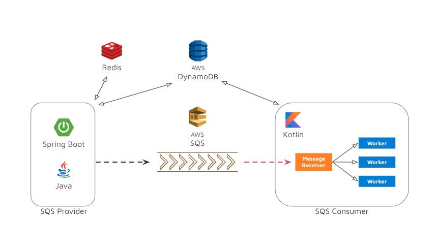

# 선착순 서비스 - API Server

> **🥇 first come, first served.**  
> REDIS, SQS, NoSQL을 사용해보기 위해 본 프로젝트를 기획했습니다.  
> 부족한 점이 많은데 객관적인 지적, 조언 해주시면 감사하겠습니다.🙂 

수량이 제한된 어떠한 대상이 있고 사용자들은 대상의 사용 권한을 얻기 위해 획득 요청을 한다.  
많은 사용자들이 제한된 대상 사용 권한을 갖기 위해 발생하는 다수의 요청을 견딜 수 있는 서버를 구축해보려고 한다.

## 기술적 목표

### Java

### Redis

API 서버 단에서 트래픽을 빠르고 효율적으로 처리하기 위해 Redis를 사용하기로 결정했다.   
메모리 기반로 빠르게 데이터를 읽올 수 있는 Key-Value Store DB인 Redis를 경험해본다.

### SQS

API 서버의 부하를 줄이고 요청된 순서를 보장받기 위해 AWS SQS를 사용하기로 결정했다.

### DynamoDB

Serverless, Fully managed 환경인 NoSQL DB를 학습해보기 위해 AWS DynamoDB를 사용하기로 결정했다.

---

## Structure

---

## 애플리케이션 작동 방식

### 대상(SUBJECT)

한정 수량의 Ticket을 설정하기 위해 대상(SUBJECT)를 등록해야 한다.  
애플리케이션이 `AWS DynamoDB`에 **Write**하는 작업은 SUBJECT를 등록하는 케이스만 허용한다.

### 티켓(TICKET)

이번 프로젝트의 목표는 순간적인 트래픽을 대응할 수 있는 애플리케이션을 구축하는 것이다.  
티켓(TICKET) 획득 요청에서 순간적인 트래픽을 발생한다는 것을 가정하고 애플리케이션을 구축했다.  
대량의 요청은 1차로 **Redis**에서 필터링을 한다. Redis에서 제한된 수량을 초과하는 요청인 경우를 바로 파악하고 Response를 한다.  
정상적인 요청은 **Redis → SQS → Worker** 흐름으로 요청이 흐른다.  
Ticket 데이터는 `AWS DynamoDB`에서 **Read** 작업만 한다. **Write** 작업은 **Consumer Worker**에서 진행한다.

---

📎 [도메인을 정리한다.](./docs/domain-entity.md)  

📎 [시나리오를 정리한다.](./docs/scenario.md)  

---

#### ☕ 도움을 주신 분

🤝 **김지황 님**  
[Redis&Kafka를 활용한 선착순 쿠폰 이벤트 개발기 (feat. 네고왕)](https://techblog.gccompany.co.kr/redis-kafka%EB%A5%BC-%ED%99%9C%EC%9A%A9%ED%95%9C-%EC%84%A0%EC%B0%A9%EC%88%9C-%EC%BF%A0%ED%8F%B0-%EC%9D%B4%EB%B2%A4%ED%8A%B8-%EA%B0%9C%EB%B0%9C%EA%B8%B0-feat-%EB%84%A4%EA%B3%A0%EC%99%95-ec6682e39731)  
선착순 시스템 설계를 고민하다 김지황 님이 쓰신 위의 글을 보게 되었고 궁금한 부분이 메일을 보냈는데 작년에 쓴 글이었음에도 불구하고 질문에 대해 상세하게 피드백을 해주셔서 프로젝트를 진행하는 데에 많은 도움이 되었습니다.